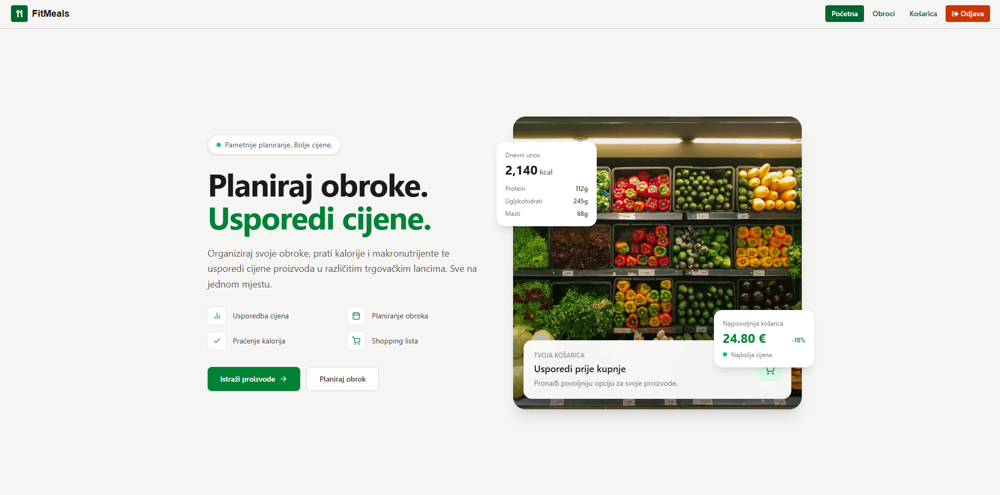
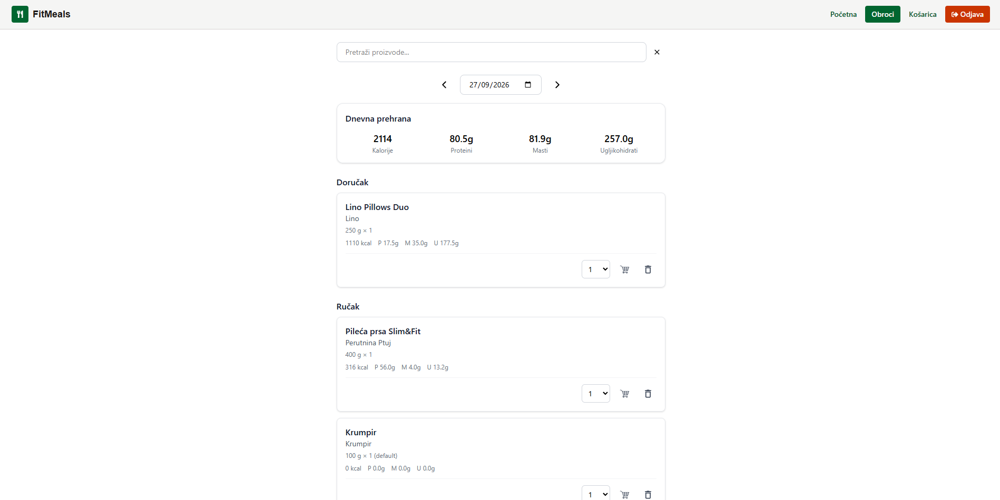
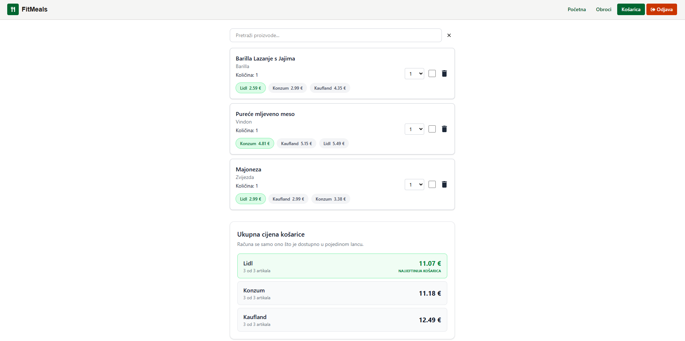

# SmartMeal

Aplikacija za planiranje obroka i pametnu kupovinu — pretraži namirnice, usporedi cijene u tri najveća lanca (Konzum, Lidl, Kaufland), sastavi obroke s automatskim izračunom kalorija, i generiraj listu za kupovinu s praćenjem ukupne cijene.

🔗 **Live demo:** [ambitious-river-09e84b403.3.azurestaticapps.net](https://ambitious-river-09e84b403.3.azurestaticapps.net)

> ⚠️ Backend je hostan na Azure free tieru koji se uspava nakon perioda neaktivnosti — prvi request nakon pauze (npr. login) može potrajati 10-20 sekundi dok se server probudi. Svaki sljedeći request je brz.

---

## Screenshots





---

## Značajke

- 🔍 **Pretraga namirnica** preko integracije s [cijene.dev](https://cijene.dev) API-jem — svaka namirnica odmah prikazuje trenutnu cijenu u tri trgovačka lanca: Konzum, Lidl i Kaufland
- 🍽️ **Planiranje obroka** po danima — dodaj namirnice u obrok, mijenjaj količine, briši ili uređuj stavke
- 🔥 **Automatski izračun kalorija** za svaki obrok na temelju dodanih namirnica i količina
- 🛒 **Košarica za kupovinu** — prebaci stavke iz obroka direktno u košaricu, aplikacija automatski izračuna ukupnu cijenu kupovine
- ✅ **Praćenje kupovine** — označi stavke kao kupljene, uredi količine ili ih ukloni iz košarice
- 🔐 **Autentifikacija** korisnika putem JWT tokena spremljenog u HttpOnly cookieju

---

## Tech stack

**Frontend**
- React + TypeScript
- Vite
- Axios
- Hostano na Azure Static Web Apps

**Backend**
- .NET (ASP.NET Core Web API)
- Entity Framework Core
- Microsoft SQL Server (Azure SQL Database)
- JWT autentifikacija (HttpOnly cookie)
- Hostano na Azure App Service

**Vanjski servisi**
- [cijene.dev](https://cijene.dev) — dohvat cijena namirnica u realnom vremenu
- [Open Food Facts](https://world.openfoodfacts.org) — dohvat nutritivnih vrijednosti namirnica po EAN kodu (`https://world.openfoodfacts.org/api/v2/product/{eanCode}.json`), koristi se za automatski izračun kalorija u obrocima

---

## API dokumentacija

Bazni URL produkcijskog API-ja: `https://smartmeal-fgguguhdb9hre6ap.swedencentral-01.azurewebsites.net`

### Auth

| Metoda | Ruta | Opis |
|---|---|---|
| GET | `/api/Auth/me` | Dohvaća podatke o trenutno prijavljenom korisniku |
| POST | `/api/Auth/register` | Registracija novog korisnika |
| POST | `/api/Auth/login` | Prijava korisnika, postavlja JWT u HttpOnly cookie |
| POST | `/api/Auth/logout` | Odjava korisnika, briše auth cookie |

### Meal Items

| Metoda | Ruta | Opis |
|---|---|---|
| GET | `/api/meal-items` | Dohvaća sve stavke obroka za odabrani datum |
| POST | `/api/meal-items` | Dodaje novu namirnicu u obrok |
| PUT | `/api/meal-items/{id}` | Ažurira količinu stavke obroka |
| DELETE | `/api/meal-items/{id}` | Briše stavku iz obroka |

### Products

| Metoda | Ruta | Opis |
|---|---|---|
| GET | `/api/Products` | Pretraga namirnica |
| GET | `/api/Products/{eanCode}` | Dohvaća detalje namirnice po EAN kodu, uključujući cijene u sva tri lanca |

### Shopping Cart

| Metoda | Ruta | Opis |
|---|---|---|
| GET | `/api/shopping-cart` | Dohvaća sve stavke u košarici |
| POST | `/api/shopping-cart` | Dodaje novu stavku u košaricu |
| PUT | `/api/shopping-cart/{id}/amount` | Ažurira količinu stavke u košarici |
| PUT | `/api/shopping-cart/{id}/bought-at` | Označava stavku kao kupljenu |
| DELETE | `/api/shopping-cart/{id}` | Briše stavku iz košarice |

---

## Pokretanje lokalno

### Preduvjeti
- Node.js 18+
- .NET SDK
- SQL Server (lokalni ili Azure SQL)

### Frontend

```bash
git clone https://github.com/tvoj-username/smartmeal-frontend.git
cd smartmeal-frontend
npm install
```

Napravi `.env` fajl u rootu s varijablom:

```
VITE_API_URL=https://localhost:7134
```

Pokreni dev server:

```bash
npm run dev
```

### Backend

Backend se nalazi u zasebnom repozitoriju: [smartmeal-backend](#) <!-- dodaj link kad postaviš -->

Konfiguriraj connection string i JWT postavke u `appsettings.Development.json`, zatim:

```bash
dotnet ef database update
dotnet run
```

---

## Arhitektura i deployment

- **Frontend** — deployan preko GitHub Actions na Azure Static Web Apps, automatski build i deploy na svaki push na `main` granu
- **Backend** — .NET Web API hostan na Azure App Service (Linux, F1 Free tier)
- **Baza** — Azure SQL Database (Free tier)
- CORS konfiguriran da dopušta zahtjeve isključivo s produkcijske frontend domene i localhosta za razvoj

---

## Licenca

Ovaj projekt je napravljen u edukativne/portfolio svrhe.
